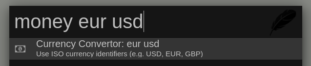
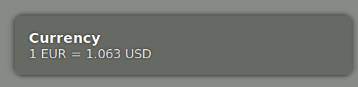

## Zazu Currency Convertor

A simple [zazu](http://zazuapp.org/) plugin which converts currencies.

### Usage

Use the prefix `currency` or `money` together with a query in the format:
`[{AMOUNT}] {FROM} to {TO}`

Examples:

- `currency EUR to USD`
- `currency 100 USD to GBP`
- `money 200 SEK in EUR`
- `money USD EUR`

### Install

Add `avaly/zazu-currency-convertor` inside of `plugins` block of your
`~/.zazurc.json` file.

```json
{
  "plugins": [
    "avaly/zazu-currency-convertor"
  ]
}
```

### Screenshots





### Credits

- The exchange rates are fetched from [fixer.io](http://fixer.io), which uses the
  European Central Bank rates.

- Logo made by [Madebyoliver](http://www.flaticon.com/authors/madebyoliver) from
  [Flaticon](http://www.flaticon.com/) is licensed by
  [CC 3.0 BY](http://creativecommons.org/licenses/by/3.0/).
